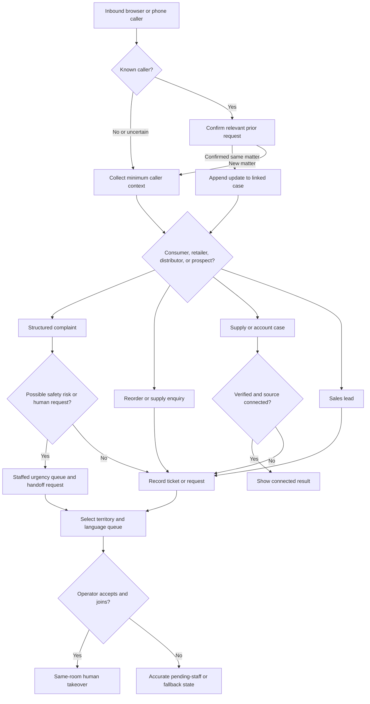

# Madhusudan Call-journey Demo Scope

## Purpose

This demo shows how one Madhusudan voice operation can recognise a caller,
retain useful context on later calls, collect a structured request, and either
create a traceable internal work item or bring a staff member into the same
conversation. It is a demonstration of a controlled support and sales
workflow, not evidence that every downstream business system is connected.

The intended experience is Hindi, English, and Hinglish. The assistant says
that it is automated and lets the caller request a person at any point.

## Scope boundary

| Included | Deferred or explicitly not claimed |
| --- | --- |
| React call desk and browser-call demo; Node/Express business API; PostgreSQL/Prisma durable records | A replacement of the existing React, Node, or Prisma application |
| Python LiveKit Agents worker with self-hosted LiveKit media and SIP as the target telephone architecture | A production carrier cutover before carrier and media validation |
| Four scripted-but-data-shaped caller journeys, with new and returning caller branches | A claim that a script represents a real ERP, DMS, CRM, or warehouse response |
| Ticket, callback-request, lead, handoff, transcript, and call-event records | A completed callback, completed order, refund, payment resolution, or stock allocation unless an approved integration returns that result |
| Structured product-complaint intake and an attachment workflow with an honest attachment state | WhatsApp delivery, photo collection through WhatsApp, or a received photo when no attachment service is connected |
| Territory and language-based queue selection, then same-room browser handoff when a staffed operator accepts | An announced transfer before a human has joined with a usable microphone |
| Sentiment observed in shadow mode and separate urgency/SOS routing with staffed fallback | An emergency diagnosis, automatic emergency-service contact, or using sentiment as the sole safety decision |
| Later voice-cloning evaluation after stable standard-voice calls | Voice cloning in the first demo or use of customer-call audio for voice training |

## Truth labels used in the demo

Every result shown to a caller or staff member has one of these labels. The UI
and spoken wording must use the same state.

| Label | Meaning | Examples in this demo |
| --- | --- | --- |
| `RECORDED` | MSVA durably stored the request in its own database. | complaint ticket, callback request, lead, handoff request |
| `CONNECTED` | A verified internal integration returned a result. | later, a real order-status adapter response |
| `FIXTURE` | Controlled sample data exists only to demonstrate a branch. | order status from the existing seeded order file |
| `UNAVAILABLE` | No approved source is connected, so MSVA cannot confirm the answer. | live inventory, ledger balance, delivery slot |
| `PENDING_STAFF` | A human action has been requested but has not happened yet. | callback request, queue assignment, photo review |

The assistant may say “I have recorded a callback request” after a durable
write. It must say “I cannot confirm live stock right now” for an unconnected
inventory source, and may not say that a photo, WhatsApp message, refund, or
order was completed unless that exact action is confirmed.

## Caller recognition and privacy rule

The first call creates or matches a `Caller` by normalized phone number and
records only the information needed for the selected journey. A returning
caller receives a short confirmation such as “I can see a previous open
request about a product concern; is this the same matter?” The assistant must
not read account, invoice, order, or complaint details aloud until the caller
confirms the relevant context. A carrier-supplied number alone is not proof
that the caller may receive account-specific information.

When the match is uncertain, the call remains a new/unknown caller workflow.
The demo records the match rationale for staff review rather than presenting a
guess as a fact.

## The four journey cards

### Journey A — Consumer product-support complaint

**Caller purpose:** A consumer reports a quality, freshness, packaging, or
possible adverse-product concern.

**New caller path:** identify language, collect name and contact confirmation,
product, batch or expiry when available, purchase area, issue category,
free-text description, and whether the product is still available. Create a
`RECORDED` complaint ticket. For a possible safety concern or an explicit
human request, route to the staffed priority queue.

**Returning caller path:** show the staff member a prior open ticket and ask
the caller whether this is an update to that ticket. If confirmed, append an
update; otherwise create a separately linked complaint. Do not merge similar
complaints solely because the caller number matches.

**Photo evidence:** After the ticket is recorded, offer a photo-evidence
request. The ticket stores `evidenceRequestedAt` and an attachment state of
`NOT_REQUESTED`, `REQUESTED`, `RECEIVED`, or `UNAVAILABLE`. `RECEIVED` is
allowed only after an authenticated attachment service has stored the object
and metadata. Until that service exists, the demo shows `REQUESTED` or
`UNAVAILABLE`; it does not imply a WhatsApp request was sent or a photo was
received. A browser-only fixture image may illustrate the staff review screen,
but it is visibly marked `FIXTURE`.

**Success:** staff can see the structured fields, related earlier ticket if
confirmed, evidence state, urgency state, and the precise next owner.

### Journey B — Retailer reordering or supply enquiry

**Caller purpose:** A retailer asks for a reorder, availability guidance,
scheme information, or distributor contact.

**New caller path:** capture shop name, contact person, territory, preferred
language, product and quantity request, delivery preference, and the requested
outcome. The first demo creates a `RECORDED` retailer enquiry/callback item;
it does not place an order or reserve inventory.

**Returning caller path:** confirm the shop and show the caller’s last open
enquiry only after confirmation. The assistant asks whether the request is a
follow-up or a new requirement, preserves both request identifiers, and
records an explicit callback preference.

**Fixture boundary:** a seeded order or availability result can demonstrate
how the call desk renders a connected response, but it is labelled `FIXTURE`.
If no approved stock source is connected, the spoken response is
`UNAVAILABLE` and the enquiry is routed to the relevant queue.

**Success:** a staff member receives a concise reorder brief with territory,
language, products, quantities, and callback window; no screen reports a
confirmed order.

### Journey C — Distributor supply or account enquiry

**Caller purpose:** A distributor asks about supply, delivery, invoice,
payment, scheme, damaged stock, or account support.

**New caller path:** identify distributor code if available, confirm an
authorised contact before discussing account information, capture reference
number, enquiry type, affected products, and the requested resolution. The
assistant creates a `RECORDED` account/supply case and routes it by territory
and language. It does not disclose a balance or invoice result without a
verified source and caller verification.

**Returning caller path:** confirm the caller’s relationship to the distributor
and the previous case reference. Show unresolved cases to staff and offer an
update or separate case. If a seeded reference is used in the demo, its result
is labelled `FIXTURE` in the call desk and in the conversation transcript.

**Success:** staff see the verification state, territory queue, source
reference, and callback/handoff state. A `PENDING_STAFF` callback remains
distinct from an outbound call that has actually connected.

### Journey D — New sales prospect

**Caller purpose:** A new retailer, distributor, institution, or prospective
partner asks to buy or work with Madhusudan.

**New caller path:** capture name, organisation, buyer role, territory,
language, product interest, estimated need, and preferred contact time. Create
a `RECORDED` lead and select the relevant sales queue. No pricing, credit,
availability, or partnership acceptance is promised unless supplied by an
approved source.

**Returning caller path:** ask whether the caller is following up on the
previous lead. If confirmed, append a dated note and retain the original lead
owner; otherwise create a linked lead. The assistant may say the sales team
will review the request, not that a meeting or callback is booked unless a
staff member has accepted it.

**Success:** the assigned sales queue sees a complete lead brief and a visible
`PENDING_STAFF` status. The caller can request a human in the same room when a
qualified operator is available.

## First demo vertical slice

Build **Journey A as a returning-consumer product complaint in a browser
LiveKit call**, including a new-caller branch. This is the smallest credible
slice because it exercises caller context, structured data capture, durable
ticket creation, evidence truth labels, language/territory queue selection,
and a real same-room handoff without relying on an ERP or an outbound carrier
integration.

The vertical slice passes only when all of the following are demonstrated:

1. A browser caller completes the new complaint path in Hindi, English, or
   Hinglish and sees a durable ticket reference.
2. A second browser call from the same controlled caller identity is offered
   prior context without exposing it before confirmation.
3. The same call can request photo evidence; the UI accurately distinguishes
   a fixture, a received object, a request, and an unavailable attachment
   channel.
4. A territory/language queue is chosen, a staff member accepts the handoff,
   joins the existing room, and is the only human audio publisher after
   takeover.
5. A safety-phrased complaint opens a staffed urgency alert even when
   sentiment is neutral; an angry routine complaint does not automatically
   become an SOS claim.

The remaining three journeys reuse the same durable identity, request,
callback, and handoff contracts. They become additional demo scripts after
the vertical slice is stable, not separate architecture projects.

## Workflow decision diagram

## Readiness dependencies and gates

| Gate | Needed before the named capability is shown as real | Evidence |
| --- | --- | --- |
| Browser voice | Self-hosted LiveKit server, worker dispatch, Sarvam and model access, and a working browser token/admission flow | two-way test conversation with stored final transcript |
| Telephone voice | Exotel SIP compatibility and inbound trunk details, SIP/media reachability, validated fallback route | completed calls from controlled test phones with carrier and application records |
| Same-room handoff | staffed queue rules, authenticated staff admission, operator presence, AI stop acknowledgement | one operator takes over while a second is denied and the caller remains connected |
| Photo received | approved private attachment storage, authenticated upload, metadata/retention policy, staff access rules | stored object and attachment metadata linked to a test ticket |
| Account/order answer | authoritative source, caller verification policy, scoped adapter, error handling | source response linked to the case without exposure to an unverified caller |
| Callback completion | approved outbound carrier path, contact permission, contact-window policy, durable attempt reconciliation | attempt outcome recorded separately from callback request |
| SOS automation | business definition, staffed primary and fallback owner, approved copy, shadow evaluation | reviewed alerts and documented missed/false-alert evidence |

## Demo run sheet

1. Open the call desk and verify the voice worker, API, media service, and the
   staffed demo operator are healthy. If any is unhealthy, run the
   deterministic transcript view and label it as a non-live fallback.
2. Run Journey A as a new caller. Show the complaint fields and the resulting
   `RECORDED` ticket. Request photo evidence and show the actual evidence
   state.
3. Repeat from the same controlled identity as a returning caller. Confirm the
   previous case before showing its summary; record a separate follow-up or
   update according to the chosen answer.
4. Speak an explicit human request. Show territory/language queue selection,
   private staff summary, the operator join, AI silence, and the human track
   becoming active.
5. Run a short version of the retailer, distributor, and prospect cards. For
   each, point out `FIXTURE`, `UNAVAILABLE`, and `PENDING_STAFF` labels where
   applicable.
6. Run a calm possible-safety complaint and an angry routine complaint. Show
   the separate urgency and sentiment records, then the staffed fallback
   state if the operator is unavailable.
7. Close by showing the call, ticket/lead, handoff, and callback-request audit
   trail. Do not claim telephone calling, live stock, account answers,
   WhatsApp, refunds, or completed callbacks unless the corresponding gate has
   evidence.

## Decisions still required

1. The business definition of SOS: product-safety only, service urgency only,
   or both; plus staffed hours, primary queue, fallback owner, and approved
   acknowledgement copy.
2. The territory-to-queue map, supported initial languages, and who may take
   each queue’s calls.
3. The authoritative source and verification procedure for distributor account
   data, order status, stock, pricing, and delivery information.
4. The approved attachment channel and retention/access policy for customer
   product photos.
5. Exotel SIP/trunk capability and the approved test number/fallback route.
6. The permitted outbound callback policy, including consent, contact windows,
   and the definition of a successful callback.
